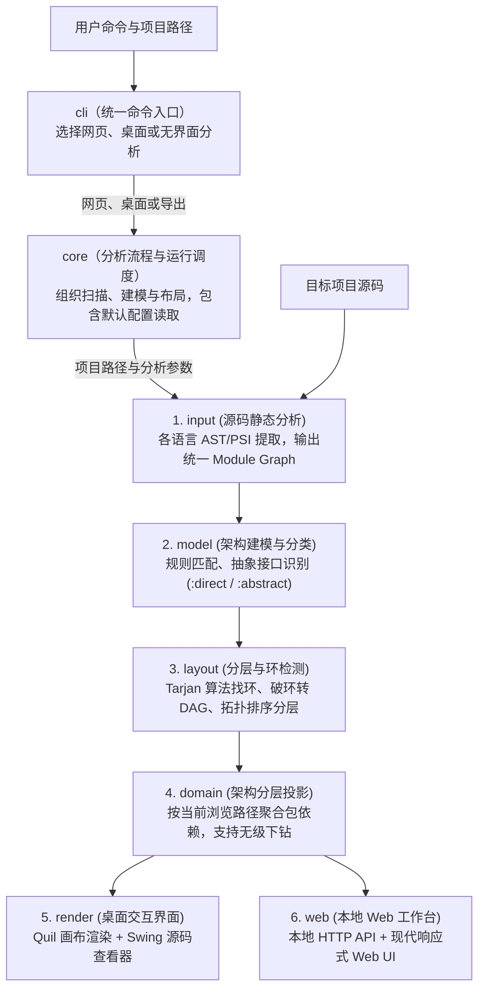

# Arch View 架构总览

## 项目说明

Arch View 是一款面向代码库的静态架构可视化工具，支持 **Clojure**、**Python**、**Kotlin** 与 **Java** 项目。它通过静态扫描源码依赖，自动计算分层布局与依赖环，并提供**桌面端（Quil/Swing）**与**现代网页端（Web 工作台）**两种交互式探索界面，帮助开发者从宏观包层级逐层下钻至源码文件。统一命令入口 `arch-view` 负责选择浏览方式、无界面分析或复制架构模板。

---

## 数据流

整个系统的处理流程遵循清晰的单向数据流管道：

---

## 核心子系统与职责

### cli · 统一命令入口（`src/arch_view/cli.clj`）

- **实现状态**：已完成。
- **职责**：接收 `arch-view` 命令，检查参数，分派到网页服务、桌面窗口或无界面分析；也可将包含新老项目 AI 提示词的架构模板复制到目标项目。
- **入口与安装**：`bin/` 中的脚本找到工具目录并调用这个源码模块；Windows 安装脚本（`bin/install.ps1`）将快捷入口放入用户目录，运行时保留用户所在的项目目录。
- **命令**：`serve` 打开网页，`desktop` 打开桌面，`scan` 分析与导出，`init` 复制模板；直接传入旧参数仍走原桌面入口。

[探索统一命令入口](#module=cli)

---

### core · 分析流程与运行调度（`src/arch_view/core.clj`）

- **实现状态**：已完成。
- **覆盖范围**：`core`、`config`。
- **职责**：组织语言识别、源码扫描、架构分类与布局计算，输出统一架构数据；负责读取已有数据、导出结果和启动桌面窗口，网页服务也复用它的项目分析入口。
- **默认配置工具**：`config.clj` 读取环境文件和环境变量，转换并检查开关、界面缩放等配置值，为运行调度提供默认参数。
- **核心入口**：项目分析（`load-architecture`）与桌面启动（`-main`）。

[探索分析流程](#module=core)

---

### 1. input · 源码静态分析 (`src/arch_view/input/`)

- **实现状态**：已完成。
- **职责**：负责不同编程语言的源码解析，提取模块节点、模块间依赖关系、抽象模块标记以及源文件路径映射。
- **设计原则**：**纯静态分析，绝不加载或执行目标项目代码**，无需目标项目的运行时依赖。
- **多语言适配**：
  - **Clojure (`clojure/`)**：基于标准库静态解析命名空间（`ns`）与依赖声明（`:require`），也识别按需加载（`requiring-resolve`）中明确写出的模块名；识别协议、多分派和接口为抽象模块。
  - **Python (`python/`)**：基于 Python 标准库 `ast` 模块独立解析，支持相对导入、别名导入与条件分支导入；识别继承 `ABC`、`ABCMeta` 或 `Protocol` 的模块。
  - **Kotlin (`kotlin/`)**：嵌入 Kotlin 官方 PSI 编译器解析器（`kotlin-compiler-embeddable`），解析包名、类型引用与内部依赖；识别 `interface` 与 `abstract class`。
  - **Java (`java/`)**：使用 JDK 编译器的语法树接口解析包、导入与类型引用，提取项目内部依赖；识别接口和抽象类，无需编译或运行目标项目。
  - **统一调度 (`languages.clj`)**：对外提供统一的 `build-module-graph` 协议与源文件探测入口。

[探索源码分析模块](#module=input)

---

### 2. model · 架构建模与依赖分类 (`src/arch_view/model/`)

- **实现状态**：已完成。
- **职责**：将各语言输出的原始依赖图规范化，并结合项目指导规则对依赖边进行语义分类。
- **依赖分类 (`classify.clj`)**：
  - **直接依赖 (`:direct`)**：依赖于具体实现模块。在渲染层以标准箭头呈现。
  - **抽象依赖 (`:abstract`)**：依赖于协议、接口或抽象基类。遵循 UML 规范，以闭合等腰三角形箭头呈现，体现面向抽象设计的依赖倒置。
- **组件划分 (`components.clj`)**：基于配置规则或目录层次结构，将分散的模块归类到业务逻辑组件或架构层中。

[探索架构模型](#module=model)

---

### 3. layout · 分层排版与环依赖检测 (`src/arch_view/layout/`)

- **实现状态**：已完成。
- **职责**：解决“如何优雅、清晰地将有向依赖图排版为垂直分层结构”的问题，同时精准诊断循环依赖。
- **处理步骤**：
  1. **强连通分量与依赖环检测**：使用改进的 Tarjan 算法提取所有成环路径（如 `A -> B -> C -> A`）。
  2. **消除依赖环**：通过精确反馈弧集（Feedback Arc Set）算法，临时移除最小权重致环边，将图转换为有向无环图（DAG）。
  3. **拓扑排序定级**：基于该 DAG 进行拓扑排序，高层消费者位于顶层，底层支撑模块位于底层。
  4. **同层水平排布**：同一依赖深度的模块并列横向排布。
  5. **保留环诊断指示**：被移除的致环边仍然作为高风险警告信息完整保留，在视图中通过红色高亮精确提示成环链路。

[探索布局计算](#module=layout)

---

### 4. domain · 架构分层投影 (`src/arch_view/domain/`)

- **实现状态**：已完成。
- **职责**：连接底层完整代码图与上层用户视图交互的核心中枢。它解决了**大型项目如何分层探索而不产生信息过载**的问题。
- **核心能力 (`architecture_projection.cljc`)**：
  - **动态聚合**：根据用户当前浏览的命名空间层级（如根目录、`arch-view.render`），自动将内部深层模块聚合到当前子包节点上。
  - **依赖提升**：当模块被聚合成包时，跨包的叶子级依赖会自动提升并去重为包之间的粗粒度依赖。
  - **混合节点支持**：同一包路径下既有子包又有独立源码文件时，自动切分为子包节点与文件节点，确保下钻逻辑无歧义。
  - **跨平台共享**：采用 `.cljc` 编写，保证桌面端与 Web 端使用 100% 相同的数据投影语义。

[探索架构投影](#module=domain)

---

### 5. render · 桌面展示界面 (`src/arch_view/render/`)

- **实现状态**：已完成。
- **职责**：基于 Processing / Quil 引擎与 Java Swing 提供的本地轻量级图形界面。
- **特性**：
  - **画布渲染 (`quil/`)**：绘制分层模块矩形、双耳组件卡片、UML 依赖箭头以及致环依赖红线。
  - **交互导航**：支持鼠标悬停查看输入/输出依赖链路列表、点击包下钻展开、返回上层导航、视图自适应缩放（支持高分屏 DPI 自适应）。
  - **源码查看 (`swing/source_window.clj`)**：点击叶子模块弹出独立纯文本代码窗口，带行号且转义安全。
  - **启动入口**：`arch-view desktop .`；保留 `clj -M:run` 原入口。

[探索桌面展示](#module=render)

---

### 6. web · 本地 Web 可视化工作台 (`src/arch_view/web/`)

- **实现状态**：已完成。
- **职责**：现代响应式浏览器工作台，专为更丰富、更易读的架构文档与交互体验而设计。
- **架构组成**：
  - **本地 HTTP 核心 (`server.clj`)**：基于轻量级 JVM `HttpServer`，仅监听 `127.0.0.1` 本机同源，零外部依赖，极速启动。
  - **数据适配与文档提取 (`model.clj` / `documents.clj`)**：
    - 读取项目根目录的 `ARCHITECTURE.md` 与包级 README，自动关联并生成交互式说明卡片。
    - 静态解析源码文件头注释（File Header Doc），无需 AI 即可提供清晰的模块职责定位。
    - 提供模块快速定位（Locate）与一键重新分析（Reanalyze）接口。
    - 读取文档中的子系统职责、人工实现状态和数据流；用三项单选框维护“已完成、未完成、进行中”，选择后保存到文档，不推断状态。未在文档里提到的源码列在图上方红框中，暂不画进图中。
  - **纯原生前端 (`assets/`)**：无任何臃肿前端打包构建工具，采用标准 ES Modules、原生 CSS Variables 与 SVG 连接线渲染，轻量流畅。
  - **启动入口**：`arch-view serve .`；保留 `clj -M:web` 原入口，可与桌面端同时运行。

[探索 Web 模块](#module=web)

---

## 数据模型

## 技术栈

| 技术 | 用途 |
| :--- | :--- |
| Clojure / 跨平台源码（`.cljc`） | 实现源码分析调度、架构建模、布局计算与共享的架构投影逻辑。 |
| Python 标准库的语法树工具（`ast`） | 静态解析 Python 源码，提取模块依赖与抽象声明。 |
| Kotlin 官方编译器解析器（`kotlin-compiler-embeddable` / PSI） | 静态解析 Kotlin 源码，提取包、类型引用与依赖。 |
| JDK 编译器语法树接口（`JavacTask` / `Trees`） | 静态解析 Java 源码，提取项目内部的类型依赖。 |
| Java 虚拟机（JVM） | 运行 Clojure 主程序与 Kotlin 解析器。 |
| Processing / Quil | 绘制桌面端架构图并处理画布交互。 |
| Java Swing | 提供桌面端源码查看窗口。 |
| Java 内置网页服务（`HttpServer`） | 提供本机网页资源与数据接口。 |
| 网页结构、样式与脚本（HTML / CSS / JavaScript）及矢量图（SVG） | 构建网页工作台、模块卡片和交互架构图。 |
| 图表描述语言（Mermaid） | 在架构文档中描述数据流，供图形展示读取。 |
| Markdown 解析器（Marked）与内容净化工具（DOMPurify） | 解析说明文档，并清理不安全的页面内容。 |
| 测试工具（Speclj） | 运行现有 Clojure 测试。 |

---

## 常用运行命令速查

| 场景 | 命令 |
| :--- | :--- |
| **安装 Windows 命令入口** | `powershell -File .\bin\install.ps1` |
| **通过统一命令打开网页** | `arch-view serve .` |
| **通过统一命令打开桌面** | `arch-view desktop .` |
| **分析并导出架构数据** | `arch-view scan . --out architecture.edn` |
| **复制架构模板与新老项目提示词** | `arch-view init .` |
| **启动 Web 可视化工作台（推荐）** | `clj -M:web --project-path .` |
| **Web 端指定 Python 项目与源码目录** | `clj -M:web --language python --project-path /path/to/py --source-path src` |
| **Web 端加载已有架构说明文档** | `clj -M:web --project-path . --architecture-doc docs/design.md` |
| **启动桌面 Quil 交互窗口** | `clj -M:run --project-path .` |
| **无头导出架构数据（EDN）** | `clj -M:run --project-path . --no-gui --out architecture.edn` |
