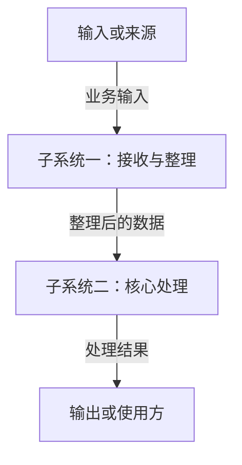

<!-- 模板用途：用简短的项目说明、数据流和子系统职责介绍宏观架构；末尾提供老项目和新项目的 AI 生成提示词。 -->

# 【项目名称】架构总览

> 使用方法：复制本文件为项目根目录的 `ARCHITECTURE.md`，替换示例内容，删除使用说明和末尾的提示词。
>
> 文档只维护宏观架构，不罗列所有文件、函数、接口或数据库字段。代码细节与实际依赖由源码分析提供。
>
> 下方 `module_a`、`module_b` 是示例标识，不规定项目必须采用这些模块。替换为实际的包或模块标识；同一子系统在流程图、三级标题和探索链接中使用相同标识，方便网页关联说明。新项目使用稳定的规划标识，目录尚未存在也可以先画图。
>
> 实现状态由项目负责人确认：只填写“已完成”“未完成”或“进行中”；老项目没有确认的状态先询问负责人，新项目未开始的子系统填写“未完成”。状态描述整个子系统，不追踪每个功能的进度。
>
> 软件包标识使用架构图中的浏览路径，例如 `input` 或 `com/example/service`（也支持点分形式）。声明一个包即可覆盖其子包和文件；未归入任何声明的源码会在图上方提示“未在架构文档里提到”，暂不画进图中，由你判断更新文档还是调整代码。文件头注释不代替子系统声明，规划子系统没有源码也不会被判定为错误。
>
> 一个子系统对应多个包或模块时，可选写 `- **覆盖范围**：` 后列出用顿号分隔的标识，例如 `core`、`config`；未填写时默认覆盖标题或探索链接声明的模块。

## 项目说明

【用一小段说明：项目为谁解决什么问题，主要提供什么能力，以及本项目负责到哪里。必要时补充一个典型使用场景。】

## 数据流

【用一两句话说明主要业务或处理过程。图中连线表示数据如何流动，连线文字说明传递什么；只画关键路径，复杂流程可拆成少量独立图。】



## 核心子系统与职责

### module_a · 【子系统一名称】

- **实现状态**：未完成。
- **职责**：【一两句话说明负责什么，必要时说明职责边界。】
- **对应位置**：【现有目录或包名；新项目写“规划目录：……”；不确定则写“待确认”。】

[探索这个子系统](#module=module_a)

### module_b · 【子系统二名称】

- **实现状态**：未完成。
- **职责**：【一两句话说明负责什么，必要时说明职责边界。】
- **对应位置**：【现有目录或包名；新项目写“规划目录：……”；不确定则写“待确认”。】

[探索这个子系统](#module=module_b)

## 数据模型

【可选。不需要时写“暂不展开”。只说明理解业务必需的核心概念及其关系，例如用户拥有笔记、订单包含商品；不要复制数据库字段或完整类型定义。】

## 技术栈

| 技术 | 用途 |
| :--- | :--- |
| 【语言或主要框架】 | 【主要承担什么工作】 |
| 【存储、通信或其他关键技术】 | 【为什么需要它，负责什么】 |

【只列架构相关的关键技术。新项目尚未决定的技术写“待选型”，不要把建议写成已采用。】

## 常用运行命令速查

| 场景 | 命令 | 必要说明 |
| :--- | :--- | :--- |
| 启动项目 | 【命令或“待补充”】 | 【必要的环境或配置前提】 |
| 验收或测试 | 【命令或“待补充”】 | 【检查什么】 |
| 构建或打包 | 【命令或“待补充”】 | 【按项目需要保留】 |

【老项目填写仓库中能找到依据的命令；未实际执行过的命令不要声称已验证。新项目尚未配置的命令写“待补充”，不要编造可执行入口。】

---

## 给 AI 的架构文档生成提示词

以下提示词用于生成真正的 `ARCHITECTURE.md`，不属于项目架构正文。复制其中一份交给 AI，并补充你的项目背景和已确认的实现状态。

### 老项目：根据现有项目整理架构

```text
请阅读本项目根目录的 ARCHITECTURE_TEMPLATE.md，并根据现有项目生成或更新根目录的 ARCHITECTURE.md。

目标：让第一次接触项目的人尽快理解项目背景、核心子系统和主要数据流；文档必须简短，便于长期维护。

请按以下要求完成：
1. 先阅读已有说明、构建配置、启动入口和关键源码，了解真实的职责划分与处理流程。已有架构文档可作为参考，不能把与源码不一致的内容直接当成事实。
2. 正文固定使用六个二级标题：项目说明、数据流、核心子系统与职责、数据模型、技术栈、常用运行命令速查。每个子系统使用三级标题。
3. 项目说明写清服务对象、解决的问题和主要能力。无法从现有材料确认的业务目的、设计意图或数据流，不要猜测；必要时写“待确认”，并在回复中集中列出需要我确认的事项。
4. 数据流使用 Mermaid 的 flowchart 语法。画关键输入、处理、存储或输出环节，给主要连线标注传递的数据；不要直接把源码导入依赖图当作业务数据流。图中的子系统标识与三级标题、探索链接保持一致，并尽量对应实际包或模块标识。
5. 每个核心子系统只写简短职责、对应位置和实现状态，不枚举所有文件、函数或接口。保留我已确认的实现状态；没有人工确认的状态先询问我确认，不要仅凭存在目录、类或方法就宣布“已完成”。
6. 数据模型按需填写，仅保留理解业务必需的概念和关系；没有必要则写“暂不展开”。技术栈和运行命令必须有项目依据，未执行的命令不要声称已经验证。
7. 使用简单易懂的中文。必要的英文术语放在中文后的括号内；代码标识、技术专名和命令保持原样。不要写成详细接口文档或设计百科。
8. 只修改 ARCHITECTURE.md，不修改源码。输出文件中不要保留模板占位说明、使用说明或本段提示词。完成后简短说明依据、尚待确认的事项，以及与现有文档发现的主要不一致；不要自行调整代码来迎合文档。

我补充的项目背景、重点和已确认状态如下：
【在这里填写；没有补充时以现有材料为准，不确定的内容留待确认。】
```

### 新项目：在编码前形成架构草案

```text
请阅读本项目根目录的 ARCHITECTURE_TEMPLATE.md，根据我提供的需求和约束，生成根目录的 ARCHITECTURE.md，作为后续编码使用的宏观架构草案。

目标：先明确项目要解决什么问题、核心职责如何划分、数据如何流动。设计应与当前需求规模相称，保持简单，方便实现后调整。

请按以下要求完成：
1. 正文固定使用六个二级标题：项目说明、数据流、核心子系统与职责、数据模型、技术栈、常用运行命令速查。每个子系统使用三级标题。
2. 根据需求写清目标用户、核心场景、主要能力和范围边界。影响整体架构的关键需求缺失时先向我确认；其他不确定内容写“待确认”，不要把假设当成已确定的需求。
3. 在项目说明中明确这是规划草案。划分满足当前需求的少量核心子系统，不强制套用固定分层，不无故增加微服务、消息队列或其他复杂设施。规划目录应标明“规划”，不能描述成已经存在。
4. 数据流使用 Mermaid 的 flowchart 语法，展示关键输入、处理、存储或输出，并标明传递什么数据。为子系统使用稳定标识，保持图中标识、三级标题和探索链接一致；规划模块尚无源码时仍可先画出。
5. 子系统说明只保留职责、对应位置和实现状态。实现状态由我确认：采用我明确提供的标记；新项目未开始的子系统写“未完成”，其他情况先询问我确认。不要根据规划内容声称已经实现。
6. 数据模型可选，只写必要的业务概念和关系，不提前展开全部字段和类型。技术栈区分“已确定”与“待选型”；不要把候选建议写成已采用。尚未配置的启动、验收或构建命令填写“待补充”。
7. 使用简单易懂的中文。必要的英文术语放在中文后的括号内；代码标识、技术专名和命令保持原样。不要把草案写成必须逐项实现的详细规格书。
8. 本次只生成 ARCHITECTURE.md，不创建业务代码、安装依赖或搭建运行环境。输出文件中不要保留模板占位说明、使用说明或本段提示词。完成后在回复中集中列出需要我确认的少量架构决策。

项目需求、约束、已确定技术和已确认状态如下：
【填写目标用户、核心场景、项目规模、部署方式、必须使用的技术，以及其他重要限制。】
```

> 后续维护：主要职责、子系统边界或关键数据流改变时，再更新这份文档；普通函数调整、文件增删和内部重构不必逐条记录。文档与代码不一致时，由负责人决定更新文档还是调整代码。
