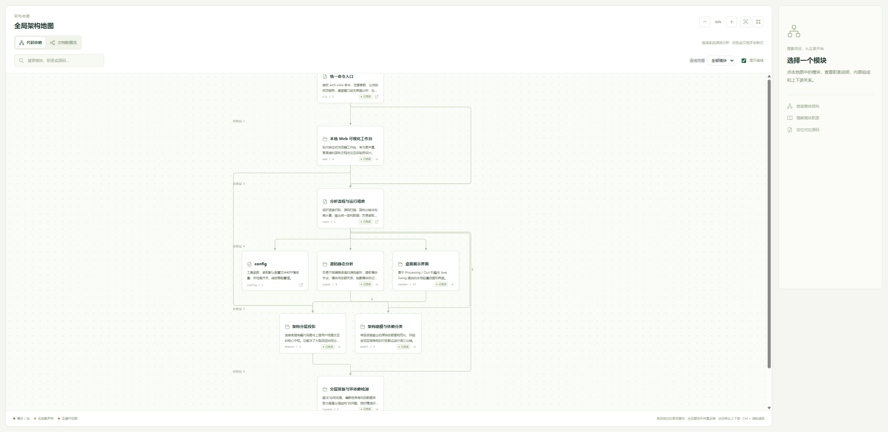
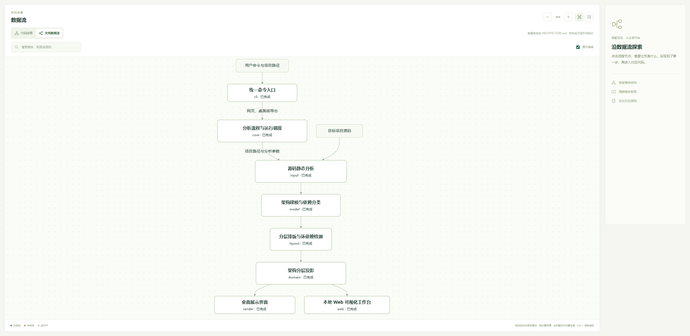

# Arch View

让开发者**随时看见真实架构**，在代码生长时拦住分层漂移、循环依赖和文档脱节，防止架构腐化。

它静态扫描 Clojure、Python、Kotlin、Java 源码，按真实依赖自动分层，把模块地图、循环依赖、`ARCHITECTURE.md` 职责说明和 Mermaid 数据流放进同一个本机工作台。下面两张图是 Arch View 分析自己：左边是源码依赖，右边是文档里的设计数据流。



*代码依赖 · `arch-view serve .` 扫描本仓库后的全屏地图。上层是入口与 Web，下层是建模、排版与环检测。*



*文档数据流 · 同一工作台读取 `ARCHITECTURE.md` 中的 Mermaid，用来对照「设计设想」和「代码现实」。*

---

## 它解决什么

架构很少一次性写坏，更多是一次次提交里慢慢偏掉：新模块插错层、依赖绕回去、文档还停在上个季度。Arch View 把**此刻仓库里的结构**摊开，让人每天都能核对：

- 分层还在不在：谁在上、谁在下，调用方向是否符合设计。
- 环有没有长出来：直接环、间接环都会标红，并能顺着链路点回去。
- 文档是否还认得代码：子系统职责、实现状态、数据流图和真实模块并排看。
- 接手项目时先看森林：从包边界下钻到文件，再打开内置源码阅读器。

分析是纯静态的，只读源码语法树，不执行目标项目、不改仓库文件。

---

## 给 AI 的 skill

仓库自带技能：[`skills/arch-view/`](skills/arch-view/SKILL.md)。

把整个 `skills/arch-view` 目录复制到代理的 skills 目录后，AI 会按模板维护 `ARCHITECTURE.md`（背景、子系统职责、Mermaid 数据流、实现状态），再用 `arch-view serve` 打开工作台。常见安装位置：

```text
~/.agents/skills/arch-view
$CODEX_HOME/skills/arch-view
```

技能会先 `arch-view init .` 补模板（已有则跳过），再生成或轻量校对 `ARCHITECTURE.md`，最后启动网页。文档与代码不一致时只指出差异，由你决定改文档还是改代码。

---

## 快速上手

Windows 在本仓库执行一次安装，之后任意项目目录都能用 `arch-view`：

```powershell
.\bin\install.ps1
```

最常用的是打开网页工作台：

```bash
arch-view serve .
arch-view serve "D:\projects\my-app" --language java --port 7332
arch-view serve . --architecture-doc docs/design.md
```

其它命令：

```bash
arch-view desktop .                 # 桌面窗口（Quil）
arch-view init .                    # 复制 ARCHITECTURE_TEMPLATE.md
arch-view scan . --out architecture.edn   # 只分析、可导出快照
```

`serve` 默认端口 7331，被占用会换端口；加 `--no-browser` 时只启动服务，把地址打给自动化流程。就绪后进程占前台，Ctrl+C 停止。

---

## 怎么读这张图

| 你看到的 | 含义 |
| :--- | :--- |
| 上高下低 | 垂直方向是依赖层次：上方多是入口与编排，下方多是基础与分析内核。 |
| 带凸耳的卡片 | 包 / 子系统。双击进入内部。 |
| 直角卡片 | 源码文件。双击打开内置阅读器。 |
| 浅蓝 / 绿色 | 普通模块；含接口、协议、抽象类时为绿色。 |
| 上三角 / 下三角 | 谁在调用我 / 我在调用谁。 |
| 红色文字或三角 | 该模块参与循环依赖，悬停看成环路径。 |
| 代码依赖 / 文档数据流 | 源码图与 `ARCHITECTURE.md` 里的 Mermaid 一键切换。 |

画布：拖空白处平移，Ctrl+滚轮缩放，点模块看上下游，点画布外的区域恢复全局高亮。右侧详情能跳到对应包；文档里的实现状态（已完成 / 进行中 / 未完成）由人在页面或 Markdown 里标记。

---

## 语言与分析范围

| 语言 | 解析方式 | 依赖识别 | 抽象标记 | 扫描范围 |
| :--- | :--- | :--- | :--- | :--- |
| Clojure | 源码静态解析 | `ns` / `:require`，以及写清目标的 `requiring-resolve` | protocol、multimethod、interface | 默认 `src` |
| Python | 标准库 AST | 相对导入、别名导入、条件分支内导入 | ABC、ABCMeta、Protocol | 优先 `src`；跳过 `venv`、`__pycache__` 等 |
| Kotlin | 官方 PSI（`kotlin-compiler-embeddable`） | 包、导入、同包与内部引用 | `interface`、`abstract class` | 默认 `src`，兼容 Gradle 多模块 |
| Java | JDK 编译器 AST | 项目内类型引用、继承、接口实现、泛型、注解 | 接口、注解类型、abstract 类 | 自动发现各模块 `src/main/java` |
| 后续语言 | 待支持 | 接入后走统一模块依赖图 | 随适配器补齐 | 随适配器补齐 |

已支持的语言统一输出模块依赖图，再交给分层、环检测和界面。运行环境需要完整 JDK；分析 Java 项目时语法版本须由当前 JDK 支持。

---

## 配置（`.env`）

可在目标项目目录放 `.env`：

```dotenv
ARCH_VIEW_LANGUAGE=auto
ARCH_VIEW_ZOOM=1.2
ARCH_VIEW_UI_SCALE=1.25
ARCH_VIEW_INCLUDE_TESTS=false
```

更多参数见 `arch-view --help` 与 `arch-view serve --help`。
