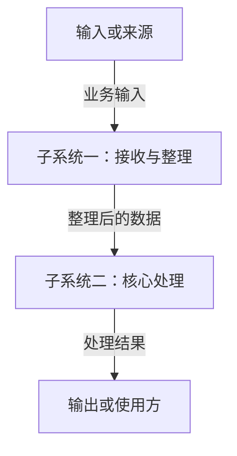

<!-- 模板用途：用简短的项目说明、数据流和子系统职责介绍宏观架构。 -->

# 【项目名称】架构总览

> 使用方法：按本模板的格式在项目根目录生成 `ARCHITECTURE.md`，替换示例内容，删除使用说明。
>
> 文档只维护宏观架构，不罗列所有文件、函数、接口或数据库字段。代码细节与实际依赖由源码分析提供。
>
> 下方 `module_a`、`module_b` 是示例标识，不规定项目必须采用这些模块。同一子系统在 Mermaid 节点和三级标题中使用相同的简短标识，例如 `service`；探索链接则填写实际代码包路径，例如 `#module=ani/rss/service`。两者可不同，网页会将流程节点关联到对应代码。新项目使用稳定的规划标识，目录尚未存在也可以先画图。
>
> 实现状态只填写“已完成”“未完成”或“进行中”。保留已有有效人工标记，可在网页上修改；状态描述整个子系统，不追踪每个功能的进度。
>
> 软件包标识使用架构图中的浏览路径，例如 `input` 或 `com/example/service`（也支持点分形式）。声明一个包即可覆盖其子包和文件；未归入任何声明的源码会在图上方提示“未在架构文档里提到”，暂不画进图中，由你判断更新文档还是调整代码。文件头注释不代替子系统声明，规划子系统没有源码也不会被判定为错误。
>
> 一个子系统对应多个包或模块时，可选写 `- **覆盖范围**：` 后列出用顿号分隔的标识，例如 `core`、`config`；未填写时默认覆盖标题或探索链接声明的模块。

## 项目说明

【用一小段说明：项目为谁解决什么问题，主要提供什么能力，以及本项目负责到哪里。必要时补充一个典型使用场景。】

## 数据流

【用一两句话说明主要业务或处理过程。图中连线表示数据如何流动，连线文字说明传递什么；只画关键路径，复杂流程可拆成少量独立图。】

## 核心子系统与职责

### module_a · 【子系统一名称】

- **实现状态**：未完成。
- **职责**：【一两句话说明负责什么，必要时说明职责边界。】
- **对应位置**：【现有目录或包名；新项目写“规划目录：……”；不确定则写“待确认”。】

[探索这个子系统](#module=module_a)

### module_b · 【子系统二名称】

- **实现状态**：未完成。
- **职责**：【一两句话说明负责什么，必要时说明职责边界。】
- **对应位置**：【现有目录或包名；新项目写“规划目录：……”；不确定则写“待确认”。】

[探索这个子系统](#module=module_b)

## 数据模型

【可选。不需要时写“暂不展开”。只说明理解业务必需的核心概念及其关系，例如用户拥有笔记、订单包含商品；不要复制数据库字段或完整类型定义。】

## 技术栈

| 技术 | 用途 |
| :--- | :--- |
| 【语言或主要框架】 | 【主要承担什么工作】 |
| 【存储、通信或其他关键技术】 | 【为什么需要它，负责什么】 |

【只列架构相关的关键技术。新项目尚未决定的技术写“待选型”，不要把建议写成已采用。】

## 常用运行命令速查

| 场景 | 命令 | 必要说明 |
| :--- | :--- | :--- |
| 启动项目 | 【命令或“待补充”】 | 【必要的环境或配置前提】 |
| 验收或测试 | 【命令或“待补充”】 | 【检查什么】 |
| 构建或打包 | 【命令或“待补充”】 | 【按项目需要保留】 |

【老项目填写仓库中能找到依据的命令；未实际执行过的命令不要声称已验证。新项目尚未配置的命令写“待补充”，不要编造可执行入口。】
